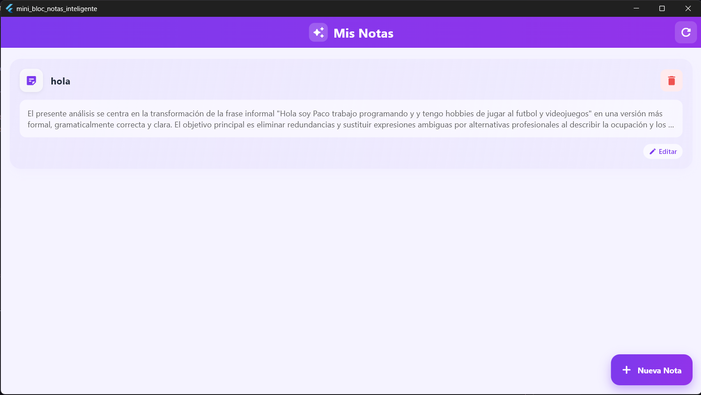
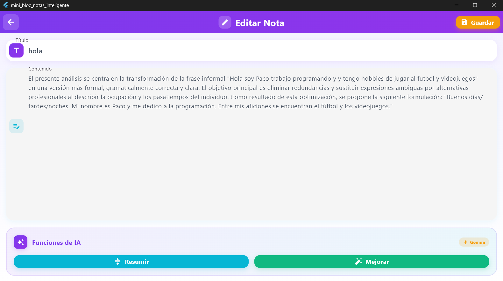

# 📝 Mini Bloc de Notas Inteligente

Aplicación Flutter de notas con funcionalidades de IA usando Gemini API.

---

## 👥 Plan de Trabajo Inicial

### División del equipo

| Miembro | Rol | Responsabilidades |
|---------|-----|-------------------|
| **Persona A** (Jesús) | Backend & Base de datos | SQLite, modelo de datos, CRUD de notas |
| **Persona B** (Eloy) | Frontend & IA | UI/UX, pantallas, tema, navegación, integración con Gemini |

### Orden de desarrollo

1. **Fase 1**: Configuración del proyecto y estructura de carpetas
2. **Fase 2**: Modelo de datos (`Note`) y base de datos SQLite
3. **Fase 3**: Provider de Riverpod para gestión de estado
4. **Fase 4**: Pantallas (lista de notas y edición)
5. **Fase 5**: Integración con Gemini AI (resumir/mejorar texto)
6. **Fase 6**: Diseño visual y tema de la aplicación

---

## 🤖 Uso de la IA en el Proyecto

### Partes donde se usó IA (GitHub Copilot)

- ✅ Estructura de carpetas y arquitectura del proyecto
- ✅ Implementación del servicio de base de datos SQLite
- ✅ Creación del provider de Riverpod
- ✅ Diseño de las pantallas y widgets
- ✅ Integración con la API de Gemini
- ✅ Resolución de conflictos de Git
- ✅ Fix de SQLite para Windows (FFI)

### Ejemplos de prompts utilizados

```
"Ayúdame a dividir el trabajo para un proyecto Flutter de bloc de notas entre dos personas"

"Crea el provider de Riverpod que conecte con SQLite para gestionar las notas"

"Implementa un servicio de IA que use la API de Gemini para resumir y mejorar texto"

"Hazlo más bonito con diferentes colores"

"La app da error en Windows: databaseFactory not initialized"
```

### Problemas que la IA ayudó a resolver

| Problema | Solución de la IA |
|----------|-------------------|
| SQLite no funcionaba en Windows | Añadir `sqflite_common_ffi` e inicializar FFI para desktop |
| Error 404 en API de Gemini | Cambiar modelo de `gemini-1.5-flash` a `gemini-2.0-flash` |
| Conflictos de merge en Git | Guía paso a paso para resolver conflictos y hacer PR |
| Diseño poco atractivo | Implementación de tema con gradientes y colores vibrantes |

---

## 🏗️ Arquitectura Básica

### Uso de SQLite

```
lib/core/database/app_database.dart
```

- **Inicialización**: Se usa `sqflite` para móvil y `sqflite_common_ffi` para Windows/Linux/macOS
- **Tabla**: `notes` con campos `id`, `title`, `content`
- **Operaciones CRUD**: `insert`, `query`, `update`, `delete`

```dart
// Ejemplo de inserción
await db.insert('notes', note.toMap());

// Ejemplo de consulta
final List<Map<String, dynamic>> maps = await db.query('notes');
```

### Uso de Riverpod

**¿Por qué Riverpod?**
- Gestión de estado reactiva y simple
- Mejor que Provider para apps complejas
- Facilita testing y mantenibilidad

**Provider creado:**

```dart
// lib/features/notes/providers/notes_provider.dart

final notesProvider = AsyncNotifierProvider<NotesNotifier, List<Note>>(() {
  return NotesNotifier();
});
```

El `NotesNotifier` expone métodos:
- `loadNotes()` - Cargar todas las notas
- `addNote(Note)` - Crear nueva nota
- `updateNote(Note)` - Actualizar nota existente
- `deleteNote(int id)` - Eliminar nota
- `getNoteById(int id)` - Obtener nota por ID

---

## ⚠️ Problemas Encontrados

| Problema | Descripción | Solución |
|----------|-------------|----------|
| **SQLite en Windows** | Error `databaseFactory not initialized` | Usar `sqflite_common_ffi` y llamar `sqfliteFfiInit()` |
| **API Gemini 404** | Modelo `gemini-1.5-flash` no encontrado | Actualizar a `gemini-2.0-flash` |
| **Conflictos Git** | Merge conflicts al juntar código de ambos miembros | Resolver manualmente y crear Pull Request |
| **Hot Reload** | Cambios en SQLite requieren reinicio completo | Usar `flutter run` de nuevo |

---

## 📸 Capturas de Pantalla

> **Nota:** Añade tus capturas en la carpeta `screenshots/` con los nombres:
> - `lista_notas.png` - Pantalla principal
> - `editar_nota.png` - Pantalla de edición
> - `resultado_ia.png` - Resultado de la función IA

### Lista de Notas (Pantalla Principal)



### Pantalla de Edición/Creación



### Resultado de IA


---

## 🛠️ Tecnologías Utilizadas

- **Flutter** 3.x - Framework de desarrollo
- **Dart** - Lenguaje de programación
- **Riverpod** - Gestión de estado
- **SQLite** (`sqflite` + `sqflite_common_ffi`) - Base de datos local
- **GoRouter** - Navegación
- **Google Gemini API** - Funciones de IA
- **Material 3** - Diseño visual

---

## 🚀 Cómo Ejecutar

```bash
# Clonar repositorio
git clone https://github.com/jesusdcintas/mini-bloc-notas-inteligente.git

# Instalar dependencias
flutter pub get

# Ejecutar en Windows
flutter run -d windows

# Ejecutar en Android
flutter run -d android
```

---

**Desarrollado por:** Jesús D. Cintas & Eloy L.R.  
**Fecha:** Noviembre 2025